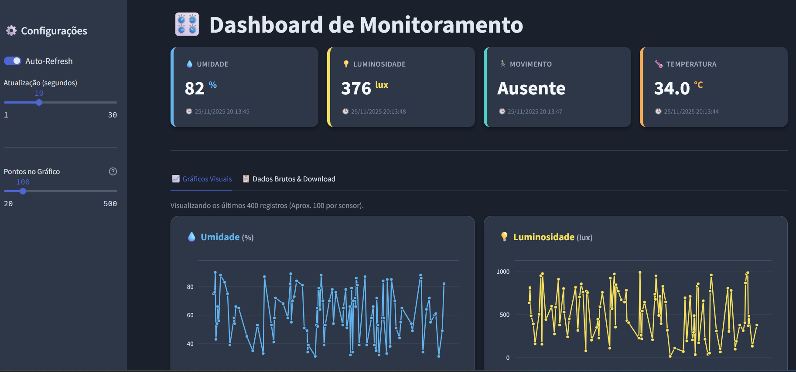

# Dashboard de Sensores


## 📝 Visão geral
O "Dashboard de Sensores" é um sistema completo de consumo (ETL), persistência e visualização de dados meteorológicos. Ele permite que usuários visualizem métricas em tempo real, identifiquem tendências através de gráficos históricos e exportem dados na forma de CSV.

O projeto simula um ambiente IoT onde sensores enviam dados que são capturados, armazenados e exibidos em um dashboard interativo.

<div align="center">

</div>

---

## ✨ Principais funcionalidades 
- **Monitoramento em Tempo Real:** Cards dinâmicos exibindo os dados mais recentes recebidos;
- **Visualização Interativa:** Gráficos de linha e barra desenvolvidos com Plotly, permitindo zoom e seleção de dados;
- **Controle de Atualização:** Intervalo de *refresh* automático customizável (com opção de pausa);
- **Persistência de Dados:** Armazenamento seguro e leve utilizando SQLite;
- **Filtragem Avançada:** Filtros para selecionar sensores específicos;
- **Exportação de Dados:** Download imediato dos dados filtrados em formato CSV.

---

## 🛠 Tecnologias usadas
Este projeto foi desenvolvido utilizando as seguintes tecnologias:

- **Linguagem Principal:** [Python](https://www.python.org/);
- **Frontend / Dashboard:** [Streamlit](https://streamlit.io/);
- **Banco de Dados:** SQLite3 (Nativo do Python);
- **Manipulação de Dados:** [Pandas](https://pandas.pydata.org/);
- **Gráficos:** [Plotly Express](https://plotly.com/python/);
- **Simulação de Sensores:** Java (arquivos .jar).

---

## 🚀 Passos para execução
### Pré-requisitos
  Antes de começar, certifique-se de ter instalado em sua máquina:
  - [Python 3.8+](https://www.python.org/downloads/);
  - [Java Runtime Environment (JRE)](https://www.java.com/pt-BR/download/) (para rodar os simuladores);
  - [Git](https://git-scm.com/).

  ### Passo 1. Clone o repositório
  ```bash
    git clone Wesley-Sousa-Dev/api-iot-dashboard
  ```

  ### Passo 2. Configuração do Ambiente Virtual
  Crie e ative o ambiente virtual para isolar as dependências do projeto:

  **Linux / macOS:**
  ```bash
    python -m venv .venv
    source .venv/bin/activate
  ```

  **Windows:**
  ```bash
    python -m venv .venv
    .venv/Scripts/activate
  ```


  ### Passo 3. Instalação das Dependências
  Com o ambiente virtual ativo, instale as bibliotecas necessárias:
   ```bash  
    pip install -r requirements.txt
   ```

  ### Passo 4. Iniciando a Simulação de Dados (Backend IoT)
  Este projeto utiliza simuladores Java para gerar os dados dos sensores. Abra um novo terminal, mantenha o ambiente virtual ativo e execute
  
  1. Inicie o servidor REST:
  ```bash
    cd utils
    java -jar server-iot-rest-example.jar
  ```

  2. Inicie os sensores (em outro terminal ou aba):
  ```bash 
    cd utils
    java -jar simulator-sensores-iot.jar
  ```

  ### Passo 5. Coleta e Persistência de Dados
  Agora precisamos rodar o script Python que consome a API Java e salva no SQLite. Na raiz do projeto, execute:
  ```bash 
    python data_writer_sqlite.py
  ```
  OBS.: Deixe este script rodando em segundo plano para que o banco de dados seja alimentado continuamente.


  ### Passo 6. Executando o Dashboard
  Finalmente, inicie a interface visual com o Streamlit:
  ```bash
    streamlit run main.py
  ```
  O navegador abrirá automaticamente no endereço http://localhost:8501.

  
